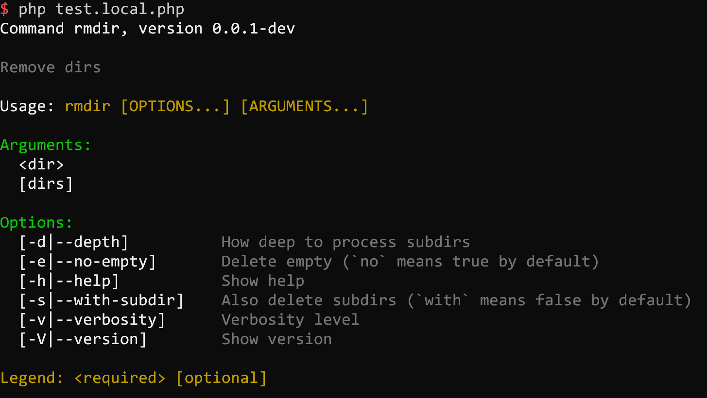
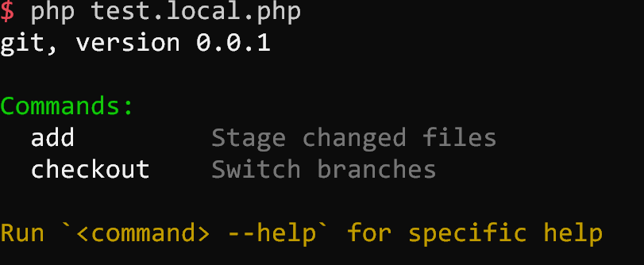

## adhocore/cli

Framework agnostic Command Line Interface utilities and helpers for PHP. Build Console App with ease, fun and love.

[](https://github.com/adhocore/cli/releases)
[](https://travis-ci.org/adhocore/cli?branch=master)
[](https://scrutinizer-ci.com/g/adhocore/cli/?branch=master)
[](https://codecov.io/gh/adhocore/cli)
[](https://styleci.io/repos/139012552)
[](LICENSE)

- Command line application made easy
- Inspired by nodejs [commander](https://github.com/tj/commander.js) (thanks tj)
- For PHP7 and for good

## Installation
```bash
composer require adhocore/cli
```

## Usage

### As argv parser

```php
$command = new Ahc\Cli\Input\Command('rmdir', 'Remove dirs');

$command
    ->version('0.0.1-dev')
    // Arguments are separated by space
    // Format: `<name>` for required, `[name]` for optional
    //  `[name:default]` for default value, `[name...]` for variadic (last argument)
    ->arguments('<dir> [dirs...]')
    // `-h --help`, `-V --version`, `-v --verbosity` options are already added by default.
    // Format: `<name>` for required, `[name]` for optional
    ->option('-s --with-subdir', 'Also delete subdirs (`with` means false by default)')
    ->option('-e,--no-empty', 'Delete empty (`no` means true by default)')
    // Specify santitizer/callback as 3rd param, default value as 4th param
    ->option('-d|--depth [nestlevel]', 'How deep to process subdirs', 'intval', 5)
    ->parse(['thisfile.php', '-sev', 'dir', 'dir1', 'dir2', '-vv']) // `$_SERVER['argv']`
;

// Print all values:
print_r($command->values());
/***
Array
(
    [help] =>
    [version] => 0.0.1
    [verbosity] => 3
    [dir] => dir
    [dirs] => Array
        (
            [0] => dir1
            [1] => dir2
        )

    [subdir] => true
    [empty] => false
    [depth] => 5
)
***/

// Pick a value by name
$command->dir;   // dir1
$command->dirs;  // [dir1, dir2]
$command->depth; // 5
```

#### Command help

It can be triggered manually with `$command->showHelp()` or automatic when `-h` or `--help` option is passed to `$command->parse()`.

For above example, the output would be:


#### Command version

It can be triggered manually with `$command->showVersion()` or automatic when `-V` or `--version` option is passed to `$command->parse()`.

For above example, the output would be:
```
0.0.1-dev
```

### As console app

We simulate a `git` app with limited functionality of `add`, and `checkout`.
You will see how intuitive, fluent and cheese building a console app is!

#### Git app

```php
$app = new Ahc\Cli\Application('git', '0.0.1');

$app
    // Register `add` command
    ->command('add', 'Stage changed files', 'a') // alias a
        // Set options and arguments for this command
        ->arguments('<path> [paths...]')
        ->option('-f --force', 'Force add ignored file', 'boolval', false)
        ->option('-N --intent-to-add', 'Add content later but index now', 'boolval', false)
        // Handler for this command: param names should match but order can be anything :)
        ->action(function ($path, $paths, $force, $intentToAdd) {
            array_unshift($paths, $path);

            echo ($intentToAdd ? 'Intent to add ' : 'Add ')
                . implode(', ', $paths)
                . ($force ? ' with force' : '');
        })
        // Done setting up this command for now, tap() to retreat back so we can add another command
        ->tap()
    ->command('checkout', 'Switch branches', 'co') // alias co
        ->arguments('<branch>')
        ->option('-b --new-branch', 'Create a new branch and switch to it', false)
        ->option('-f --force', 'Checkout even if index differs', 'boolval', false)
        ->action(function ($branch, $newBranch, $force) {
            echo 'Checkout to '
                . ($newBranch ? 'new ' . $branch : $branch)
                . ($force ? ' with force' : '');
        })
;

// Maybe it could be named `handle()` or `run()`, but again we keep legacy of `commander.js`
$app->parse(['git', 'add', 'path1', 'path2', 'path3', '-f']);
// Will produce: Add path1, path2, path3 with force

$app->parse(['git', 'co', '-b', 'master-2', '-f']);
// Will produce: Checkout to new master-2 with force
```

#### App help

It can be triggered manually with `$app->showHelp()` or automatic when `-h` or `--help` option is passed to `$app->parse()`.
**Note** If you pass something like `['app', cmd', '-h']` to `$app->parse()` it will automatically and instantly show you help of that `cmd` and not the `$app`.

For above example, the output would be:


#### App version

Same version number is passed to all attached Commands. So you can trigger version on any of the commands.

...wip
